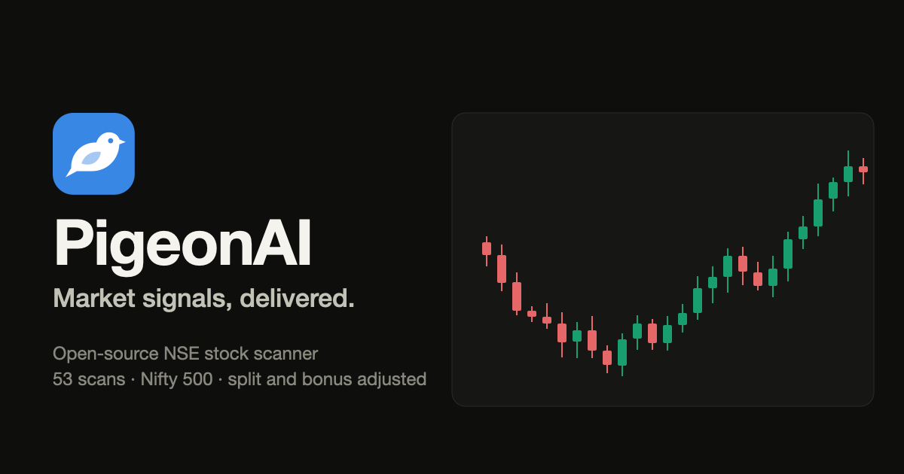

<p align="center"><a href="https://chndr-prksh.github.io/pigeonai/"></a></p>

# PigeonAI

**Market signals, delivered.** Live site: https://chndr-prksh.github.io/pigeonai/

PigeonAI is an open-source scanner and charting site for NSE stocks, named for the carrier
pigeon that brings the message home: a market breadth page, a screener with 53 scans that can be combined, and a
chart page for every stock in the Nifty 500.

For information and education only. Not investment advice.

## From a Google Sheet to this

This repository started in 2021 as a Python notebook that computed indicator values for
NSE stocks and pushed them into a Google Sheet, where every scanner was a column. This is
a complete rewrite: TypeScript, a static website, and the NSE MCP server (launched October
2026) as the data source. The notebook and the sheet plumbing are gone; they remain in the
git history.

Every scanner column from the sheet is here:

| Column in the sheet | Scan here |
|---|---|
| Volume Boom | Volume boom |
| Beats 5D Avg Vol! | Beats 5-day average volume |
| Hulky Gainers/Losers | Hulky gain, Hulky loss |
| Bullish/Bearish Reversal | Bullish reversal, Bearish reversal |
| Near 52w H/L | Near 52-week high, Near 52-week low |
| 52w Breached! | New 52-week high, New 52-week low |
| 52w Momentum Breach | Strong 52-week high, Strong 52-week low |
| 3 day streak! | 3-day up streak, 3-day down streak |
| PV Breakout | PV breakout |
| 2MPV Breakout | 2-month PV breakout |
| NR4, NR7 | NR4, NR7 |
| NR4 Breakout, NR7 Breakout | NR4/NR7 +ve and −ve breakouts |
| Moving Average Crossovers | Rose above / dropped below SMA 20, Golden cross, Death cross |
| Price Trend | Six-state trend filter, Bullish stack, Bearish stack |
| Pivot, S1, S2, R1, R2 | Pivot levels on every stock page and chart |
| 30-Day Chart | 30-day sparkline in the screener |

The sheet published values, not formulas, so each rule was worked back from the stocks it
flagged. Where a threshold had to be chosen, the scan's description on the site states it;
`src/lib/scans.ts` is the single place to change one.

Added on top: trend template, ADX trend strength, RS rating (1–99), reclaimed/lost 200 DMA,
pullback to 20 EMA, MACD crossovers, RSI extremes, volume surge, highest volume in a year,
up/down on volume, Bollinger squeeze, wide-range day, inside bar, gaps, bullish engulfing,
20- and 50-day breakouts, and closes beyond pivot R2/S2.

## How it works

```
NSE MCP server ──> pipeline/run.ts ──> public/data/*.json ──> static React site
 (bhavcopy)         adjust, scan         (no backend)          (Lightweight Charts)
```

There is no server. A scheduled job pulls end-of-day data, adjusts it for splits and
bonuses, runs every scan and writes JSON; the site is static files that read that JSON.

- `pipeline/mcp.ts` — a small MCP client (Streamable HTTP), throttled, that stops on HTTP 403.
- `pipeline/adjust.ts` — split and bonus adjustment (see below).
- `src/lib/indicators.ts`, `src/lib/scans.ts` — indicators and scan definitions, shared by
  the pipeline and the charts so the two can never disagree.
- `src/` — the site: Market, Screener, Watchlist, Stock, About.

## Running it

```bash
npm install
npm run data      # fetch and build the data (first run: about an hour, see below)
npm run dev       # http://localhost:5183
```

Pipeline options: `--limit 40`, `--symbols TCS,INFY`, `--offline` (rebuild from the cache
without network), `--refill` (retry history older than what is cached).

`npm test` runs the adjustment tests. `npm run build` type-checks and builds to `dist/`.

## Things worth knowing about the NSE data

**Prices are raw.** A 1:1 bonus shows up as a 50% overnight fall. The MCP corporate-actions
tool only reaches back about a year (RELIANCE's Oct 2024 bonus and BAJFINANCE's Jun 2025
split and bonus are absent), so it cannot be the only source. `adjust.ts` accepts a feed
event only when the price actually gapped by that ratio, and separately infers events from
overnight gaps that no price band allows and that land on a split/bonus ratio. Each stock
page lists the adjustments applied and where each came from, and the chart can be switched
to prices as traded.

**History has a hole.** As of October 2026 the server returns nothing between 11 Jan 2023
and 31 Dec 2023. Indicators must not run across a gap, so only the unbroken stretch from
January 2024 is used. If NSE restores the data, `npm run data -- --refill` picks it up.

**It rate-limits.** Around a thousand calls in ninety seconds earned an HTTP 403 from NSE's
edge. The client sends at most two requests a second and aborts the run on a 403 instead
of retrying. The first backfill is about a dozen calls per symbol. After that a daily run
is roughly a hundred calls: `get_bulk_quote` covers 50 symbols per call, and a quote is
appended only when its previous close matches the last cached bar.

**Terms.** NSE describes the MCP data as for informational and educational purposes. Read
NSE's terms before using this commercially; redistribution of exchange data normally needs
a licence.

## Deployment

`.github/workflows/daily.yml` refreshes the data at 19:30 IST on weekdays and deploys to
GitHub Pages. The raw price cache lives in the Actions cache, not in git.

## Credits

Charts by [TradingView Lightweight Charts™](https://github.com/tradingview/lightweight-charts)
(Apache 2.0). Nifty 500 constituents from niftyindices.com. Not affiliated with NSE.

MIT licence.
